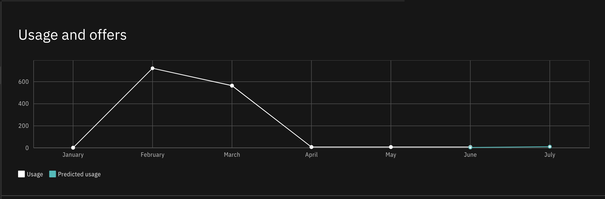
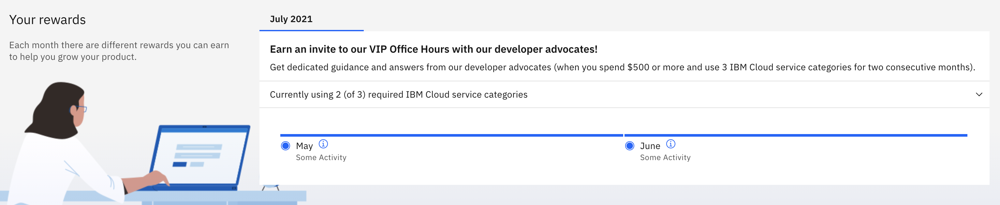

---

copyright:
  years: 2021
lastupdated: "2021-12-02"

keywords: partner center, usage, offers

subcollection: sell

---

{{site.data.keyword.attribute-definition-list}}

# Exploring usage and offers
{: #build-usage-offers}

On the Usage and offers page of Partner Center, you can review your usage details, explore relevant offers and rewards from {{site.data.keyword.cloud}}, and access tools and services.
{: shortdesc}

To view and edit details about usage and offers, make sure you're assigned at least the editor role on the Partner Center account management service. For more information, see [Assigning access to account management services](/docs/account?topic=account-account-services&interface=ui#account-management-actions-roles).

## Reviewing usage
{: #build-review-usage}

In the Usage and offers tab of Partner Center, you can see your month-to-month usage and predicted usage in a high-level graph.

1. Go to the [Partner Center](https://cloud.ibm.com/partner-center/sell){: external} in the {{site.data.keyword.cloud_notm}} console, and click **Build** > **Usage and offers**.
2. Move your cursor over each point of the graph to see the charges for that month.
3. To explore in-depth details, click **Details**.

{: caption="Figure 1. An example of a usage graph from the Usage and offers page" caption-side="bottom"}

## Viewing rewards
{: #build-rewards}

Each month, {{site.data.keyword.cloud_notm}} provides different rewards to help you grow your product. Rewards are given to accounts that complete tasks that are described in the Your rewards section of the Usage and offers page. To see your progress toward the month's rewards, go to the [Partner Center](https://cloud.ibm.com/partner-center/sell){: external} in the {{site.data.keyword.cloud_notm}} console, click **Build** > **Usage and offers**, and scroll until you see the Your rewards section. You can expand the section to see more details.

{: caption="Figure 2. An example of a rewards section from the Usage and offers page" caption-side="bottom"}

## Exploring tools, services, and events
{: #build-tools-services}

Throughout the page, you see various tools, services, and events that can help you build your product.

- Events to learn about products and platforms
- Services to help you deploy products
- Tools and consultations to help you develop your product
- Communities to explore knowledge topics

To view these items, go to the [Partner Center](https://cloud.ibm.com/partner-center/sell){: external} in the {{site.data.keyword.cloud_notm}} console, click **Build** > **Usage and offers**, and explore the page.
