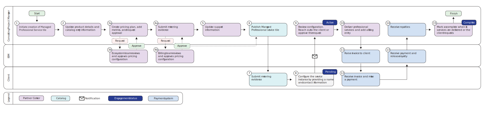

---

copyright:
  years: 2025

lastupdated: "2025-12-12"

keywords: managed professional services, getting started, partner center, partner center sell, global catalog

subcollection: sell

content-type: tutorial
account-plan: paid
completion-time: 10m

---

{{site.data.keyword.attribute-definition-list}}

# Getting set up to sell managed professional services
{: #mps-getting-started}
{: toc-content-type="tutorial"}
{: toc-completion-time="10m"}

Welcome to {{site.data.keyword.cloud}}! To start onboarding your managed professional services as a partner, you can use Partner Center to set up the offering. It process includes onboarding your product, configuring custom parameters and contact information, setting up new pricing plans, adding metrics to your pricing plan, providing support details, and managing resource provisioning. After your service is published, it becomes available in the {{site.data.keyword.cloud_notm}} catalog, ready for clients to discover and consume.
{: shortdesc}

Managed professional services provide clients with end-to-end solutions delivered and maintained by expert partners, eliminating the need for clients to manage technical complexity themselves. These services typically include setup, configuration, monitoring, compliance, and ongoing support, which can ensure reliability and scalability. By using tools like Partner Center for service creation and the {{site.data.keyword.cloud_notm}} for seamless discovery and provisioning, businesses can access tailored, fully managed offerings that accelerate time-to-value and reduce operational burden.

## Lifecycle management of an engagement
{: #lifecycle-engagement}

Onboarding your professional services to {{site.data.keyword.cloud_notm}} involves eight major steps. Check out the following workflow for a walk-through of the complete process.

{: caption="Onboard managed professional services to {{site.data.keyword.cloud_notm}}."}

1. The partner registers the service in Partner Center
1. The client selects the service from the catalog and creates an instance
1. The partner reviews and approves the professional service engagement request
1. The service engagement becomes active
1. The partner manually bills the client for the service
1. The client submits a request to complete the engagement (optional)
1. The partner approves or marks the engagement as completed
1. The engagement is complete

**Partner role**:
The partner uses Partner Center to onboard and configure managed professional services. This process involves setting up the service offering, defining custom parameters, adding contact and support details, creating pricing plans with relevant metrics, and managing resource provisioning. For more information on how to manage published engagements as a partner, see [Administering managed professional services as a partner](/docs/sell?topic=sell-consume-mps-partner&interface=ui).

**Client role**:
Clients access the {{site.data.keyword.cloud_notm}} catalog to explore and select published managed professional services. They can review the available offerings and engage with the service as configured by the partner, ensuring a streamlined experience for consuming professional services. For more information on how to manage published enagagements as a client, see [Consuming managed professional services as a client](/docs/sell?topic=sell-consume-mps-client&interface=ui).

## Before you begin
{: #mps-getstart-prereqs}

* Verify that you're using a Pay-As-You-Go or Subscription account. To check which type of account you're using, go to **Manage > Account > Account settings** in the {{site.data.keyword.cloud_notm}} console.

   It's recommended that you use an account that was created with a [functional ID](/docs/account?topic=account-identity-overview#functionalid-bestpract) to help ensure your continued access to the products that are onboarded in the account.
   {: tip}

* Verify that you're assigned as the administrator role on all account management services and all IAM-enabled services. See [Assigning access to account management services](/docs/account?topic=account-account-services) and [Managing access to resources](/docs/account?topic=account-assign-access-resources).

## Onboard your product
{: #onboard-product}
{: step}

The partner starts the onboarding process. Creates and onboards managed professional services in the {{site.data.keyword.cloud_notm}} console.

1. In the {{site.data.keyword.cloud_notm}} console, click the **Navigation Menu** icon  > **Partner Center > My products**.
1. On the **My products** page, click **Create**.
1. Click **Create a product**, and click **Next**.
1. Click **Start now**.
1. Select **Managed Professional service** and click **Next**.
1. Enter a display name for your product.
1. Enter a programmatic name for your product, and click **Next**. The programmatic name is used when you want to use CLI to manage a service.
1. Review your product details and click **Create**.

## Set custom parameters and contact information to your product
{: #catalog-details}
{: step}

The partner sets custom parameters and contact information, and specifies the email address to route the request to. Define the team and brand identity as part of the onboarding process.

On the newly created product page, click **Product listing > Catalog entry** and enter the required details in the **Your catalog entry** and **Your product page** sections to preview the catalog tile.

## Set up new pricing plans for your product
{: #create-pricing}
{: step}

The partner creates a new pricing plan. When a managed service is onboarded, pricing is defined through plans. Each plan represents a specific offering, such as Standard or Premium, and includes details like features and cost. For every plan, you can associate a set of usage metrics to track consumption and billing. This structure allows flexibility, enabling multiple plans under the same service to meet different client needs.

1. Click **Product listing > Pricing** and click **Add plan > Usage-based**.
1. Enter a name for your plan.
1. Enter a programmatic name.
1. Enter a description.
1. Click **Save**.

## Add metrics to your pricing plan
{: #add-metrics}
{: step}

The consulting partner then adds metrics to measure usage with usage-based pricing plans.

1. From the **Pricing plan** table, click **Add metrics**.
1. In the **Usage metrics** section, click **Add metrics**.
1. Enter a value to state the charges per unit.
1. Select the unit for measuring metrics.
    * **Hours**: Represents the amount of time spent delivering the service during the engagement.
    * **Implementation**: Captures a one-time agreed upon cost for setting up or configuring the service.

    The **Hours** unit is the most frequently used measurement.
    {: note}

1. Optionally, specify the unit in which the value must be displayed.
1. Select the unit that the client is charged for.
    * Per unit: Price per single unit.
    * Tiered: Price varies based on the quantity. The more the quantity, the lesser the price.
1. Enter the price per unit based on the unit that is selected.
1. Click **Done**.
1. In the **Pricing approval** section, click **Request approval**. An IBM approver approves the request.

## Provide support information
{: #provide-support-information}
{: step}

As part of onboarding, it’s important to provide support information so clients can easily reach out when they have questions or need assistance. It includes specifying contact details, support channels, and response expectations. Clear support information help ensure smooth communication between partners and clients throughout the engagement.

1. Click **Product listing > Support** and enter the details in the **Customer support information** section.
1. Enter the details in the **Support escalation process** section.
1. Add support contact information.

## Next steps
{: #mps-getstart-next}

Now that you completed the onboarding tasks, you're ready to manage published engagements.

- To manage published engagements as a client, see [Consuming managed professional services as a client](/docs/sell?topic=sell-consume-mps-client).
- To manage published engagements as a partner, see [Administering managed professional services as a partner](/docs/sell?topic=sell-consume-mps-partner).

To get an overview of all the tasks involved in the process, see the [Checklist for selling managed professional services on {{site.data.keyword.cloud_notm}}](/docs/sell?topic=sell-checklist-mps&interface=ui).
{: tip}
