---

copyright:

  years: 2022, 2024

lastupdated: "2024-01-05"

keywords: IBM Cloud, metering model, metering service, usage, pricing

subcollection: sell

---

{{site.data.keyword.attribute-definition-list}}

# Metering integration
{: #service-metering-integration}

{{site.data.keyword.cloud}} supports multiple models for aggregating product usage, and with Partner Center, you can measure various metrics for services with usage-based pricing plans. You can measure metrics on the created instances, and submit those measures to the metering service. The submitted usage is aggregated into different buckets (instance, resource group, and account) based on the model that you choose. The aggregation and rating models for all metrics in a plan are contained in the metering and rating definition documents for the plan.
{: shortdesc}

The following list describes the expectations for tracking and submitting usage:

*	Third-party providers don't need to submit usage for free plans or monthly subscription plans.
*	For metered plans, all providers must submit usage hourly, and usage for Lite plans must be submitted every 15 minutes to 1 hour.
*	You're responsible for automating the usage submission, including automation that retries failure responses. To automate the usage submission, you can create cron jobs, or other similar job schedulers. {{site.data.keyword.cloud_notm}} doesn't provide a retry function for failed submissions. For more information, see the status codes and actions table in [Submitting usage records](/docs/sell?topic=sell-service-add-metrics#submit-usage).

{: caption="Figure 1. Understanding the function of the {{site.data.keyword.cloud_notm}} Usage Metering service for automating the submission of usage data."}

*	You must submit usage records for the current month by the second day of the following month.
*	{{site.data.keyword.cloud_notm}} is configured for a monthly billing cycle and time is represented in Coordinated Universal Time (UTC).
* You must test usage submission and validate your results to describe how the monthly billing cycle is calculated.

For more information about pricing, see [How to calculate your costs](/docs/billing-usage?topic=billing-usage-cost#cost).

## Configuration properties
{: #service-configure-properties}

The following properties define how {{site.data.keyword.cloud_notm}} meters and rates usage submissions for product plans:

Unit
:   Metrics to be metered, for example, ApiCall, Bytes, Hours, Instances, and Nodes.

Aggregation
:   How the metered unit data is compiled, for example INSTANCES_BY_MONTH, or ACTIVE_HOURS_BY_MONTH.

Metering model
:   How the usage submission data is processed, as shown in the metering and model types table.

Resource name
:   The name of the resource that is being measured, for example, storage, instance, virtual server, or bytes transmitted.

Unit name
:   The descriptive name of the unit if the default name isn't relevant for the product.

## Metering model types
{: #service-metermodel-type}

See the following table for information about the available metering models and a brief description of each type:

|  Type | Description  |
|-----|-----|
| `standard_add` | Add quantity from all submitted usage records for a month. |
| `standard_max`  | Maximum quantity from all submitted usage records for a month. |
| `standard_avg` | Average quantity from all submitted usage records for a month. |
| `dailyproration_max` | Calculated daily maximum. The sum up all the days for the month. |
| `dailyproration_avg` | Calculated daily average. The sum up all the days for the month. |
| `monthlyproration` | Calculated similar to the daily proration, but the price that is used is the plan price that is divided by the total number of days for the month (daily price). |
{: caption="Table 1. Metering model" caption-side="top"}

### Examples
{: #example}

The quantity in dashboard value in each of the following examples is before the next usage is submitted, but after the current usage is processed.

#### Standard Add
{: #standard-add-usage}

See the following table for information about how to calculate the monthly usage.

Formula: ADD(usages)

| Time            | Usage  | Calculation | Quantity in dashboard |
|-----------------|:-------------:| ----------- |:---------------------:|
| Day 1 (morning) | 5             | 5           | 5                     |
| Day 1 (night)   | 5             | 5 + 5       | 10                    |
| Day 2 (morning) | 5             | 10 + 5      | 15                    |
| Day 3 (morning) | 5             | 15 + 5      | 20                    |
| Day 4 (night)   | 5             | 20 + 5      | 25                    |
{: caption="Table 2. Monthly usage calculations" caption-side="top"}

#### Standard Average
{: #standard-average-usage}

See the following table for information about how to calculate the average monthly usage. Submitting 0 usage counts toward the average.

Formula: AVG(usages)

| Time            | Usage | Calculation             | Quantity in dashboard |
|-----------------|:-------------:| ----------------------- |:---------------------:|
| Day 1 (morning) | 4             | 4 / 1                   | 4                     |
| Day 1 (night)   | 0             | (4 + 0) / 2             | 2                     |
| Day 2 (morning) | 5             | (4 + 0 + 5) / 3         | 3                     |
| Day 3 (morning) | 3             | (4 + 0 + 5 + 3) / 4     | 3                     |
| Day 4 (night)   | 3             | (4 + 0 + 5 + 3 + 3) / 5 | 3                     |
{: caption="Table 3. Average monthly usage calculations" caption-side="top"}

#### Standard Max
{: #standard-max-usage}

See the following table for information about how to calculate the maximum monthly usage.

Formula: MAX(usages)

| Time            | Usage  | Calculation  | Quantity in dashboard |
|-----------------|:--------------:| ------------ |:---------------------:|
| Day 1 (morning) | 5              | MAX(5)       | 5                     |
| Day 1 (night)   | 10             | MAX(5, 10)   | 10                    |
| Day 2 (morning) | 0              | MAX(10, 0)   | 10                    |
| Day 3 (morning) | 15             | MAX(10, 15)  | 15                    |
| Day 4 (night)   | 1              | MAX(15, 1)   | 15                    |
{: caption="Table 4. Maximum monthly usage calculations" caption-side="top"}

#### Daily proration Average
{: #daily-proration-average}

Calculate the average usage for each day and average it for the month. The average of each day is added and divided by the number of days currently passed (in UTC).

Formula: Summation(daily average) / Number of days passed in the billing period

The quantity might change throughout the month, but what is rated is the average usage per day.
{: note}

Given a 30-day month, use the following table to calculate the daily proration average:

| Time               | Usage    | Daily average | Calculation                            | Quantity in dashboard *                          |
| ------------------ | :--------------: | ------------- | ------------------                     | :----------------------------------------------: |
| Day 1 (morning)    | 8                | 8 / 1         | 8 / 1                                  | 8                                                |
| Day 1 (night)      | 3                | (8 + 3) / 2   | 5.5 / 1                                | 5.5 (On Day 1 EOD)                               |
| Day 2 (morning)    | 2                | 2 / 1         | (5.5 + 2) / 2                          | 3.75                                             |
| Day 2 (night)      | 5                | (2 + 5) / 2   | (5.5 + 3.5) / 2                        | 4.5 (On Day 2 EOD)                               |
| Day 3 to Day 15    | 1                | 1 / 1         | (5.5 + 3.5 + (1 + 13)  / 15            | 1.4666 (On Day 15 EOD)                          |
| Day 15 to Day 30   | 0                | 0 / 1         | (5.5 + 3.5 + (1 \* 12) + (0  \* 15) / 30 | 0.7333 (On Day 30 EOD)                          |
{: caption="Table 5. Average usage per day and monthly average calculations" caption-side="top"}

\*: As seen on the same day as when the usage was submitted.

#### Daily proration Max
{: #daily-proration-max}

Calculate the maximum usage per day and average it for the month. The maximum of each day is added up and divided by the number of days currently passed (in Coordinated Universal Time).

Formula: Summation(daily max) / number of days passed in billing period

The quantity might change throughout the month, but the maximum usage per day is rated.
{: note}

Given a 30-day month, see the following table to calculate the maximum usage per day and monthly average:

| Time             | Usage   | Daily Max | Calculation                    | Quantity in dashboard * |
|------------------|:--------------:| --------- | ------------------------------ |:----------------------:|
| Day 1 (morning)  | 0              | MAX(0)    | 0 / 1                          | 0                      |
| Day 1 (night)    | 1              | MAX(0, 1) | 1 / 1                          | 1                      |
| Day 2 to Day 15  | 1              | MAX(1)    | (1 + 1 + ...) / day            | 1                      |
| Day 15 to Day 30 | 0              | MAX(0)    | (1 + (1 * 14) + 0 + ...) / day | < 1                    |
{: caption="Table 6. Maximum usage per day and monthly average calculations" caption-side="top"}

\*: As seen on the same day as when the usage was submitted.

#### Monthly proration
{: #meter-integration-type-monthlyproration}

Divides the usage cost at the time of service creation by the remaining number of days in the month (in UTC, including the current day). Each subsequent month is not prorated. The full monthly charge is applied, regardless of how much the instance is used.

Formula:
- If provisioned date is from the current month: (Unit Price) * (Number of days that are remaining in the month / Number of days in the month)
- If provisioned date is from the previous month: (Unit Price)

Given a 30-day month, see the following table to calculate the monthly prorated cost:

| Time             | Usage          | Calculation                    | Quantity in dashboard  |
|------------------|----------------|--------------------------------|------------------------|
| Month 1, Day 1   | 1              | 1 * (30/30)                    | 1                      |
| Month 1, Day 16  | 1              | 1 * (16/30)                    | 0.5                    |
{: caption="Table 7. Monthly prorated cost calculations" caption-side="top"}

When you submit your resource usage, the `end` time value is the first day when your customers are billed and all following days in the month are also subject to billing. The `end` and `start` time values must be the same for usage submissions. For more information about submitting your resource usage, see [Submitting resource usage to the {{site.data.keyword.cloud_notm}} Usage Metering API](/docs/sell?topic=sell-service-add-metrics#submit-usage).
{: note}

## Pricing models
{: #pricing-model}

The following table provides detailed information about the pricing models that are available. For many of the available metrics, you select an associated pricing model.

| Model          | Description | Calculation | Example (5000 quantity) |
|:-----------------|:-------------|:----------- |:---------------------|
| Linear         | Multiply the unit price per resource (P) by the usage quantity (Q) to get the total amount (T)  | P * Q    | P=$1 T=1 * 5000 =$5000        |
| Simple tier (granular tier)  | A P * Q model in which the unit price for all consumption is determined by the tier the quantity falls into.           |   \n  \nIf Q is <=Q1, T=P1 * Q  \n  \nIf Q1 < Q <=Q2, T=P2 * Q  \n  \nIf Q2 < Q <=Q3, T=P3 * Q  \n  \n | \n  \nQ1=1000, P1=$1  \n  \nQ2=2500, P2=$0.9  \n  \nQ3=10000, P3=$0.75  \n  \nT=$0.75 * 5000=$3750  \n  \n              |
| Graduated tier (step tier)   | The price per unit varies as the quantity-consumed moves into different predefined tiers. The total charge involves cumulating the charges from the previous tiers           |   \n  \nT1=P1 * Q (0 < Q  \n  \nIf Q1 < Q <=Q2, T=T2  \n  \nIf Q2 < Q <=Q3, T=T3  \n  \n     |   \n  \nQ1=1000, P1=$1, T1=1 * 1000  \n  \nQ2=1500, P2=$0.9, T2=0.9 * 1500  \n  \nQ3=10000, P3=$0.75, T3=0.75 * 2500  \n  \nT=1000 +1350+1875=$4225  \n  \n         |
| Block tier (up to)           | The total amount that is charged is established by an up to quantity that doesn't vary within the block     |   \n  \nIf Q is <=Q1, T=T1  \n  \nIf Q1 < Q <=Q2, T=T2  \n  \nIf Q2 < Q <=Q3, T=T3  \n  \n    |   \n  \nQ1=1000, T1=$0  \n  \nQ2=2500, T2=2500  \n  \nQ3=10000, T3=$4500  \n  \nT=$4500  \n  \n            |
{: caption="Table 8. Pricing models" caption-side="top"}

Block tier pricing is not currently supported. If your product migrated from the resource management console, and you used block tier pricing, it is still honored. However, currently, you can't add any new block tier pricing plans.
{: note}

## Metrics for metering models
{: #metering-model-types}

If you created your service with Partner Center, you can choose from the following metrics and default metering models:

| Type | Metric |
|-----|-----|
| `dailyproration_max` | Active User |
| `standard-add` | API call |
| `dailyproration_max` | Authorized User |
| `standard_add` | Gigabyte hour |
| `standard_add` | Gigabyte month |
| `monthlyproration` | Instance |
| `standard_add` | Terabyte hour |
| `standard_add` | Terabyte month |
| `dailyproration_max` | User |
| `standard_add` | Virtual Server |
| `standard_add` | Virtual Server Hour |
| `standard_add` | Virtual Processor Core |
{: caption="Table 9. Partner Center metering model metrics" caption-side="top"}

Third-party providers that migrated from the resource management console to Partner Center can manage their metering models with Partner Center. Any information that you added or edited for pricing plans and metering models by using the resource management console can be updated in Partner Center.
{: note}
