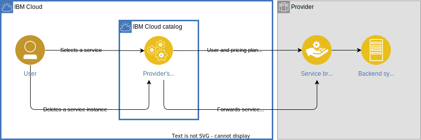

---

copyright:

  years: 2022, 2024

lastupdated: "2024-01-08"

keywords: service brokers, build service broker, IBM Cloud platform, new service brokers, OSB, open service broker, partner center, host service broker

subcollection: sell

---

{{site.data.keyword.attribute-definition-list}}

# Building and hosting your service brokers
{: #broker-dev-host}

The {{site.data.keyword.cloud}} platform interacts with service brokers to create and manage service instances and service bindings. You can build and host your broker by using a combination of public {{site.data.keyword.cloud_notm}} service broker samples including the Open Service Broker Automation Reference App, and the Open Service Broker API documentation.
{: shortdesc}

When you onboard your service to {{site.data.keyword.cloud_notm}}, you must build one or more service brokers to manage the lifecycle of your service and its metering integration. For more information, see [Metering integration](/docs/sell?topic=sell-service-metering-integration).

## What is a service broker?
{: #broker-what-is}

Service brokers manage the lifecycle of services. Platforms interact with service brokers to create, get access to, and manage the services they offer. The Open Service Broker API defines these interactions to allow software providers to offer their services to anyone regardless of the technology or infrastructure those software providers choose. The service broker acts as a middleware component that handles the automatic provisioning of service instances for a product, and it helps with the usage tracking of the service instances.

A broker is useful if you are developing and offering software as a service, platform as a service, or infrastructure as a service across multiple vendors. It can increase business value by introducing the service broker to automate the provisioning and binding for customers. Also, customer management and usage tracking can be easier with a middleware component that handles these cross-cutting concerns. However, a service broker is not suitable if you have custom software that can be deployed on any virtual machine or platform. 

When a user selects your service and its pricing plan from the {{site.data.keyword.cloud_notm}} catalog and creates an instance, the data for the service including the pricing plan and metrics, is sent to your service broker. The broker is integrated with the backend system that manages the provisioning of service instances and the metrics for a selected pricing plan. If a customer deletes an instance of the product, a request is sent to the service broker, and it manages the deprovisioning of the instance.

{: caption="Figure 1. Understanding the role of a service broker when a user selects a product from the {{site.data.keyword.cloud_notm}} catalog."}

The broker architecture provides significant benefits for both development and operations teams:

* Developers can connect their applications and containers to the backing services they need. The operation is the same, regardless of the backing service.
* Operators no longer have to manually create and delegate access to services. Instead, they configure a marketplace of services and service plans. From there, developers can self-serve, reducing the administrative costs many enterprises face today.

Each service broker that's built to the Open Service Broker API specification has the same intuitive set of lifecycle commands. These commands provide useful benefits for the service broker:

Fetching the catalog of backing services that a service broker offers
:   The catalog describes all services that can be created through a service broker, and each service is made up of plans. Plans typically represent the costs and benefits for a specific variant of the service. Many services use plans related to the size the product, for example small, medium, and large.

Provisioning new service instances
:   A service instance is a created instance of a service and plan as described in the service broker’s catalog.

Connecting and disconnecting applications and containers from those service instances
:   When a service instance is created, you want your application or container to start communicating with that instance. From a service broker’s perspective, this action is called a service binding.

Deprovisioning service instances
:   This action deletes all the resources that are created upon the initial creation of the service instance.  

## Before you begin
{: #pc-broker-pre-reqs}

* [Register your service in {{site.data.keyword.cloud_notm}} Partner Center](/docs/sell?topic=sell-svc-register).
* [Define the product details of your service](/docs/sell?topic=sell-svc-define).
* Review the [Provisioning scenario](/docs/sell?topic=sell-how-it-works#provision2) to gain an understanding of how resource creation works.
* Read and familiarize yourself with the [Open Broker API spec](https://github.com/openservicebrokerapi/servicebroker/blob/v2.12/spec.md){: external}, and use the readme file as a guide to learn more. {{site.data.keyword.cloud_notm}} uses the Open Service Broker API (OSB) `version 2.12` specification.

## Building and hosting your broker
{: #pc-broker-guides}

Every service that is onboarded to the {{site.data.keyword.cloud_notm}} catalog requires building a broker app that follows the Open Service Broker (OSB) spec. As you onboard through Partner Center, you are required to provide your broker app URL. The [Open Service Broker Automation Reference App](https://github.com/IBM/open-service-broker-automation){: external} automates the process of configuring and deploying a service broker that has your required specifications. The reference app also handles the hosting of the service broker by creating the skeleton structure of the code, pushing it to GitHub and hosting it on {{site.data.keyword.codeenginefull_notm}}.

### Prerequisites for building your broker
{: #prereqs-build-broker}

Before you can create your service broker with the help of the Open Service Broker Automation Reference App, make sure to complete the following prerequisites:

* You must have access to {{site.data.keyword.codeenginefull_notm}}.
* You must have access to the GitHub account, where the source code is being pushed to.
* Set the following environment variables to run the script in the [`.env` file](https://github.com/IBM/open-service-broker-automation/blob/main/.env){: external}:
    * `orgs_id`: Specify the organization name for the account, where the source code is pushed to. If you want to push the source code directly to your account, keep the field empty. This variable is not mandatory to set.
    * `git_user_id`: Specify the Git username for the account, where the source code is pushed to.
    * `token`: Create and specify the Git token with the following permissions: access to all repositories including private ones, workflow access to update GitHub action workflows, and permission to delete GitHub repositories.
    * `apikey`: Create your {{site.data.keyword.cloud_notm}} API key by following the [Creating an API key](/docs/account?topic=account-userapikey&interface=ui#create_user_key) instructions. Assign the following permissions by using {{site.data.keyword.iamshort}} and specify them in the `apikey` field: 
        * Administrator access for the Catalog Management service
        * Editor access for the Partner Center - Sell service
        * Editor access for the IAM Access groups service
        * Editor access for {{site.data.keyword.codeenginefull_notm}}
        * Editor access for {{site.data.keyword.registryfull_notm}}
    * `region`: Specify the region where you want to deploy your {{site.data.keyword.codeengineshort}} project.
    * `resource_group`: Specify the resource where you want to deploy your {{site.data.keyword.codeengineshort}} project. 

### Building and hosting your broker
{: #pc-broker-build-host}

Configure and deploy the service broker that has your required specifications by using the following steps: 

Explore the broker sample codes that use [Java](https://github.com/OSB-Hackathon/osb-spring-server){: external}, or [Node.js](https://github.com/OSB-Hackathon/osb-nodejs-server){: external} code languages to see how you can structure your broker to meet requirements.
{: tip}

1. Go to the [Open Service Broker Automation Reference App](https://github.com/IBM/open-service-broker-automation){: external} and use it as a guide to create your broker. The reference app automates the process of configuring and deploying your service broker that has your required specifications, and it also handles the hosting of the broker. For more information about the application requirements and further deployment instructions, see the [Open Service Broker Automation Reference App readme file](https://github.com/IBM/open-service-broker-automation#readme){: external}. 

1. Go to [{{site.data.keyword.cloud_notm}} Open Service Broker API](/apidocs/resource-controller/ibm-cloud-osb-api){: external} to set the required specifications, including required endpoints.

### Scaling your app
{: #scalability}

After you deploy your app to {{site.data.keyword.codeenginefull_notm}}, it autoscales your app by default. {{site.data.keyword.codeengineshort}} scales an app up to 10 runtime instances by default and down to zero, which means that the app does not consume any resources when it is not in use. For more information, see [Scaling, high availability, and traffic management](/docs/codeengine?topic=codeengine-migrate-cf-ce-scale).

### Including required endpoints
{: #pc-endpoints}

All service brokers must set certain required endpoints. Additional endpoint logic is required for bindable services and disabling and reenabling service instances.

#### Required endpoint logic for all service brokers
{: #pc-endpoint-sb}

Service brokers must provide a standard set of metadata values that are consumed by REST APIs, and {{site.data.keyword.cloud_notm}} brokers must have logic for the following REST API endpoints or paths:

catalog (GET)
:   Returns your catalog metadata included in your broker. 

resource instances (PUT)
:   Creates your service instance.

resource instances (DELETE)
:   Deletes your service instance.

resource instances (PATCH)
:   Updates your service instance.

**Note on catalog (GET)**: This endpoint defines the contract between the broker and the {{site.data.keyword.cloud_notm}} platform for the services and plans that the broker supports. This endpoint returns the catalog metadata that is stored within your broker. These values define the minimal contract between your service and the {{site.data.keyword.cloud_notm}} platform. All additional catalog metadata that isn't required is stored within the {{site.data.keyword.cloud_notm}} catalog. Any updates to catalog display values like links and icons must be updated in the {{site.data.keyword.cloud_notm}} console, and not housed in your broker. None of metadata that is stored in your broker is displayed in the {{site.data.keyword.cloud_notm}} console or the {{site.data.keyword.cloud_notm}} CLI. The console and CLI return what was set within Partner Center Sell and stored in the {{site.data.keyword.cloud_notm}} catalog. The following section shows the minimal-required values that catalog (GET) returns:

```json
{
       "services": [{
           "id": "0bc9d744-6f8c-4821-9648-2278bf6925bb",
           "name": "ibmcloud-link",
           "description": "An IBM provided service that enables aliasing to service instances in the IBM Cloud.",
           "bindable": true,
           "plan_updateable": false,
           "plans": [
               {
                   "id": "da40662d-2f72-4a19-8c79-8c77cf285e1",
                   "name": "ibmcloud-alias",
                   "free": true,
                   "description": "The IBM Cloud alias plan used for linking."
               }
               ]
       }]
}
```
{: codeblock}

#### Required endpoints logic for bindable services
{: #pc-bindable}

If your service can be bound to applications in {{site.data.keyword.cloud_notm}}, it must return API endpoints and credentials to your service consumers. A bindable service must use the bindable operations in the Open Service Broker specification, and implement the following endpoints or paths:

bindings and credentials (PUT)
:   Binds your service instance to an application.

bindings and credentials (DEL)
:   Unbinds your service instance from an application.

#### Required {{site.data.keyword.cloud_notm}} extension endpoints
{: #pc-extension}

The OSB specification doesn't support a disabled instance state. A disabled state includes a missing payment or other situations that result in an account suspension (but not yet cancellation) and is different from a deleted instance state. For {{site.data.keyword.cloud_notm}} to support customers that might experience a disabled state, {{site.data.keyword.cloud_notm}} defined the extended API endpoints that allow service instances to be disabled and reenabled. The following endpoint extensions are required:

enable and disable instances (GET)
:   Status - returns the state of your service instance.

enable and disable instances (PUT)
:   Enable or disable a service instance.

It's the service provider's responsibility to disable access to the service instance when the disable endpoint starts and to re-enable that access when the enable endpoint is started.
{: note}

### Broker information provided by the {{site.data.keyword.cloud_notm}} platform
{: #pc-broker-info}

Your service broker or brokers receive the following information from the {{site.data.keyword.cloud_notm}} platform:

#### X-Broker-API-Originating-Identity
{: #pc-x-broker}

The **user identity header** is provided through an API originating identity header. This request header includes the user's {{site.data.keyword.cloud_notm}} IAM Identity. The IAM Identity is base64 encoded. {{site.data.keyword.cloud_notm}} supports a single authentication realm: `IBMid`. The `IBMid` realm uses an IBMid Unique ID (IUI) to identify the user's identity in {{site.data.keyword.cloud_notm}}. This IUI is an opaque string to the service provider.

Example:

```text
X-Broker-API-Originating-Identity: ibmcloud eyJpYW1faWQiOiJJQk1pZC01MEdOUjcxN1lFIn0=
Decoded:
{"iam_id":"IBMid-50GNR717YE"}
```
{: codeblock}

#### API header version
{: #pc-api-header}

The **API version header** is [2.12](https://github.com/openservicebrokerapi/servicebroker/blob/v2.12/spec.md){: external}. For example: `X-Broker-Api-Version: 2.12`.

#### resource instance (PUT) body.context and resource instance (PATCH) body.context
{: #put}

`PUT /v2/service_instances/:resource_instance_id` and `PATCH /v2/service_instances/:resource_instance_id` receive the following value within **body.context**: `{ "platform": "ibmcloud", "account_id": "tracys-account-id", "crn": "resource-instance-crn" }`.

## Additional broker recommendations
{: #pc-more-info}

### Recommendations on using asynchronous instead of synchronous operations
{: #pc-asynch-ops}

The OSB API supports both synchronous and asynchronous modes of operation. If your operations are going to take less than 10 seconds, you must use synchronous responses. Otherwise, you must use the asynchronous mode of operation. The asynchronous mode requires the `last_operation` endpoint. For more information, see [Get the status of a provision in-progress for a service instance](/apidocs/resource-controller/ibm-cloud-osb-api).

### Recommendations for managing brokers across locations
{: #pc-managing-broker}

It's important for users to understand the location of their cloud services for latency, availability, and data residency.

When you're creating service instances on {{site.data.keyword.cloud_notm}}, one of the required parameters your users provide is the location where they want that service instance to be created. Some services can support creation in multiple locations. For example, a database service can support creation in all {{site.data.keyword.cloud_notm}} regions or it can support a subset.

If your third-party API-based service is implemented in another cloud and exposed into {{site.data.keyword.cloud_notm}}, the location indicates the service's location in the other cloud.

When you onboard your product to {{site.data.keyword.cloud_notm}}, you must implement at least one OSB broker. You can have more than one broker depending on your deployment strategy and the locations you want to support for your service. Within Partner Center Sell, you establish the mapping between your pricing plan and the broker. The typical choices are to define a single broker to service all locations for your service or to define a broker per location; this choice is up to the service provider.

For a list of available locations, review the [{{site.data.keyword.IBM_notm}} global catalog locations](https://globalcatalog.cloud.ibm.com/search?q=kind:geography&noLocations=true){: external}. If your service requires more locations to be defined, consult the {{site.data.keyword.cloud_notm}} onboarding team.

### Recommendations for end-to-end tracing
{: #pc-e2e-tracing}

The call from the {{site.data.keyword.cloud_notm}} platform to the service broker always sends the `Transaction-Id` header in the request, enabling end-to-end tracing and problem determination for your service broker. Make sure to log this data so any recurring issues can be identified quickly.

For the asynchronous mode of operation, each call to the `last_operation` endpoint has its own `Transaction-Id`.
 
## Next steps
{: #next-host-test-broker} 

After you built your service broker, you're ready to [modify and test it](/docs/sell?topic=sell-broker-modify-test).
