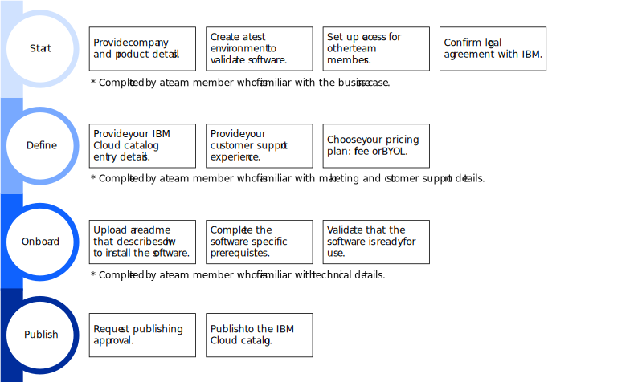

---

copyright:

  years: 2020, 2021

lastupdated: "2021-09-01"

keywords: end-to-end, software onboarding, checklist, third party, requirements, sellers, partner portal, partners, third-party software, partner center

subcollection: sell

---

{:right: .ph data-hd-position='right'}
{:shortdesc: .shortdesc}
{:table: .aria-labeledby="caption"}
{:codeblock: .codeblock}
{:screen: .screen}
{:tip: .tip}
{:note: .note}
{:beta: .beta}
{:term: .term}
{:external: target="_blank" .external}
{:video: .video}

# Checklist for selling software on {{site.data.keyword.cloud_notm}}
{: #checklist-software}

Use the following checklist to track all the tasks that are required to successfully onboard and sell your third-party software on {{site.data.keyword.cloud}}.
{: shortdesc}

The process to sell third-party software is still under development. With the current release, you can bring your own licenses or deliver your third-party software for free. If you have questions, contact us at kdmeyer@ibm.com.
{: beta}

## Before you begin
{: #sw-software-type}

Review the list of supported software:
  
* Helm charts on Kubernetes and {{site.data.keyword.redhat_notm}} {{site.data.keyword.openshiftshort}} clusters
* Terraform templates
* OVA images deployed on VMware vCenter Server
* Virtual server images with Terraform deployed on VPC infrastructure
* Operators with a CSV file or Operator bundles with a TGZ file from GitHub repositories deployed on Red Hat OpenShift
* Operator bundles from Red Hat OpenShift registries

## Watch and learn
{: #onboard-software}

Onboarding software to {{site.data.keyword.cloud_notm}} involves four major steps: registering your product, defining your catalog entry and other details, onboarding your product, and publishing your product to the {{site.data.keyword.cloud_notm}} catalog. In the following demo, we use a sample Operator to walk you through the entire process.

{: video output="iframe" data-script="#onboard-software-script" id="mediacenterplayer" frameborder="0" allowfullscreen webkitallowfullscreen mozAllowFullScreen}

### Video transcript
{: #onboard-software-script}
{: notoc}

As a third-party vendor, onboarding software to the {{site.data.keyword.cloud_notm}} catalog involves four major steps - getting started, defining your product, onboarding your product, and, finally, publishing your product. In this demo, we'll show you the onboarding process for an Operator. 

Get started in the Partner Center - your one-stop shop for onboarding third-party products to {{site.data.keyword.cloud_notm}}. [Click **Get started** on the Partner Center home page to open the Getting started dashboard].

Provide the name of your company, then create your test environment. This test environment will house your product during the onboarding process. [In the Create your test environment section, click **Create**]

Next, invite team members to help you onboard your product. You can also send invites later from the My My Team page in Partner Center. [In the Assign access section, click **Assign**. In the Onboard your product section, click **Let's go**.]

Before you begin defining the details of your product, confirm your legal agreement with {{site.data.keyword.IBM}}. You can instantly accept the {{site.data.keyword.IBM_notm}} Digital Provider Agreement, or you can upload your own custom agreement, which will need to be reviewed and approved by {{site.data.keyword.IBM_notm}}. [Click **Confirm your digital provider agreement**.]

After confirming your agreement, Click **Create**, and add the name of your product. 

Information that you provide on the Catalog entry tab displays on your product's catalog tile in the {{site.data.keyword.cloud_notm}} catalog. Provide a link to your company or product logo and a description of your product. To help users find your software in the catalog, select the category that best fits your product. [Click **Catalog entry**. Then, click **Add logo** to add a link to your logo. Then, click **Enter description** to enter a description of your product. Then, click **Select category**.]

Next, select the third-party provider type. You can also enter keywords to help users find your Operator in the catalog. [Click **Select a type**.]

Then, define the pricing model for your software. Currently, you can select a free plan or a bring your own license plan. Note that a Bring your own license, or BYOL plan requires a URL to the license. [Click **Pricing** and select the Free pricing model.]

{{site.data.keyword.IBM_notm}} and users of your Operator will need support information in case there are any issues with your software. Provide a link to your support site, and describe the support process with as much detail as possible. Make sure to include contact information and response times. [Click **Support**. Then, click **Provide URL** to add your support site URL. Click **Desribe process for responding to support issues** to describe the support process. Then, click **Provide the countries in which support is available** to add support locations.]

{{site.data.keyword.IBM_notm}} may need to be involved in the support process, so be sure to provide a direct contact to your support team. [Click **Describe process for {{site.data.keyword.cloud_notm}} response to support issues** and provide a description of the support process. Click **Provide support contact information** to share the support contacts with {{site.data.keyword.IBM_notm}}.]

From the Software tab, you can begin importing your product. In your test environment, select Operator as your deployment method. Confirm your public source repository and provide the URL. Make sure this repository contains your CSV file. Then, enter the version of your software. [Click **Software**. Then, click **Import a version**.]

After importing a version of your software, you can configure your Operator. Since we're using the {{site.data.keyword.IBM_notm}} Container registry, which is public, we don't need to set an image pull secret. An image pull secret is needed if you want to use your own private container registry. 

If there are additional terms of use that end users are required to accept, add a link to the end user license agreements. Note that third-party products require an end user license agreement. [Click **Add license agreements**.]

Users access installation instructions for your Operator in your readme file, which is generated from your CSV file. Review the readme, make any edits if needed, and save it. [click **Edit readme**.]

To validate your Operator, select your target cluster and project. Then, return to Partner Center to finish onboarding your product. [Click **Validate product**. Select a cluster, and click **Add project** to add a new project. CLick **Next > Next > Validate** to validate your product. Once validation is complete, click **Go to Partner Center**.]

In Partner Center, your Onboarding checklist should indicate that all required steps are complete. Review all the tabs to make sure the information is accurate, then request approval of your software.

{{site.data.keyword.cloud_notm}} will review your Operator and will either approve your product, or request an update. You'll get an email with details about any changes that you might need to make. 

After your Operator is approved, you're ready to return to Partner Center and publish your software. [Click **Refresh status** then, click **Publish**.]

Your software is now live and available to users in the {{site.data.keyword.cloud_notm}} catalog. [Click **View in {{site.data.keyword.cloud_notm}} catalog** and search for the name of the product to open it.]

## Workflow for selling software on {{site.data.keyword.cloud_notm}}
{: #sw-workflow-image}

The following diagram summarizes the process of onboarding software to the {{site.data.keyword.cloud_notm}} catalog. For details about each task, see the sections that follow.

{: caption="Figure 1. The workflow for onboarding software to the {{site.data.keyword.cloud_notm}}" caption-side="bottom"}

## Register your product
{: #sw-start-checklist}

The following tasks are typically completed by a team member who is familiar with the business case for the product. 

| Task | Description | Environment |
|------|-------------|-------------|
|  Provide your company and product details | Specify the names of your company and product.  | {{site.data.keyword.cloud_notm}} console | 
|  Create a test environment | The test environment is used to onboard your software and validate it's ready for use. | {{site.data.keyword.cloud_notm}} console |
|  Assign team access | With the correct {{site.data.keyword.cloud_notm}} Identity and Access Management (IAM) access, members of your team can help onboard your software. | {{site.data.keyword.cloud_notm}} console |
|  Invite team members to your account | Members of your account are assigned the IAM access that you set up in the previous task.  | {{site.data.keyword.cloud_notm}} console |
|  Confirm your legal agreement with {{site.data.keyword.IBM}} | Review and accept the {{site.data.keyword.IBM_notm}} Digital Provider Agreement, or upload your custom digital provider agreement to be reviewed and approved by {{site.data.keyword.IBM}}. | {{site.data.keyword.cloud_notm}} console |
{: caption="Table 1. Getting started tasks for selling software" caption-side="top"} 

For more information, see [Getting set up to sell software](/docs/sell?topic=sell-sw-getting-started). 

## Tell us about your product 
{: #sw-details-checklist}

The following tasks are typically completed by a team member familiar with the business case, marketing details, and customer support experience for the product. 

| Task | Description | Environment |
|------|-------------|-------------|
|  Verify your partner details | Review the product name that you provided as part of the getting started tasks to make sure that everything is correct. | {{site.data.keyword.cloud_notm}} console |
|  Define your product details | Add details, such as your product logo, keywords, description, features, and documentation URL, for your product's entry and details page in the {{site.data.keyword.cloud}} catalog. | {{site.data.keyword.cloud_notm}} console |
|  Define your customer support experience | Provide details about how users can get help with using your software.  | {{site.data.keyword.cloud_notm}} console |
|  Define your pricing information | Choose your pricing plan: free or BYOL. If BYOL, provide details about your license.  | {{site.data.keyword.cloud_notm}} console |
{: caption="Table 2. Tasks for defining software details" caption-side="top"} 

For more information, see the following links:

* [Defining your catalog entry and product page](/docs/sell?topic=sell-sw-catalog-details)
* [Defining your support experience](/docs/sell?topic=sell-sw-support-details)

## Onboard your product
{: #sw-validate-checklist}

The following tasks are typically completed by a technical member of your team. 

| Task | Description | Environment |
|------|-------------|-------------|
|  Set up your source code repository | Create a release in your source code repository to deliver and manage versions of your software. | Your GitHub repository |
|  Upload a readme file | Provide a readme file that describes how users can install your software and get customer support. | Your GitHub repository |
|  Onboard your software| Import a version, configure the deployment details, set any license requirements, and validate that the version can be successfully installed on the infrastructure that you require. | {{site.data.keyword.cloud_notm}} console |
{: caption="Table 3. Tasks for onboarding software" caption-side="top"} 

For more information, see the following links:

* [Setting up your source code repository](/docs/sell?topic=sell-source-repo-setup)
* [Onboarding your software](/docs/sell?topic=sell-sw-validate)

## Publish your product
{: #sw-publish-checklist}

The following tasks are completed by any member of your team. 

| Task | Description | Environment |
|------|-------------|-------------|
|  Verify that all tasks are completed | Confirm that you completed the getting started tasks, defined your software details, and onboarded your software. | {{site.data.keyword.cloud_notm}} console |
|  Request to publish your software | Submit a request for {{site.data.keyword.cloud_notm}} to review your product details and approve it's ready for publishing. | {{site.data.keyword.cloud_notm}} console |
|  Publish your software | After your publishing request is approved, publish your software to the {{site.data.keyword.cloud_notm}} catalog. | {{site.data.keyword.cloud_notm}} console |
{: caption="Table 4. Tasks for publishing software" caption-side="top"} 

For more information, see [Publishing your software to the {{site.data.keyword.cloud_notm}} catalog](/docs/sell?topic=sell-sw-publish).

As a third-party provider, you're responsible for maintaining all assets of published software in the {{site.data.keyword.cloud}} catalog and deprecating outdated versions.  
{: note}
